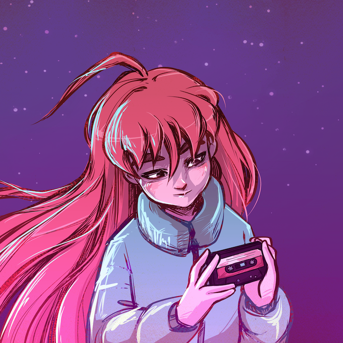

Celeste is probably the best 2D platformer game I have ever played because it is
the only platformer I remember completing. I have beaten other platformers where
games feel like a chore to get to the end credits. In Celeste, there is an overwhelming
sense of accomplishment at every level. The artwork describing the chapters and a jingle
that plays on finishing them add to this feeling.

<iframe
    style="border: 0; width: 100%; height: 120px;"
    src="https://bandcamp.com/EmbeddedPlayer/album=1272541581/size=large/bgcol=ffffff/linkcol=2ebd35/tracklist=false/artwork=small/track=2631597877/transparent=true/"
    seamless
>
    <a href="https://radicaldreamland.bandcamp.com/album/celeste-madelines-grab-bag">Celeste - Madeline&#39;s Grab Bag by Lena Raine</a>
</iframe>

I beat the main game in January, reaching The Summit with zero crystal hearts
and zero cassettes yet to be discovered. I completed Chapter 8: Core last weekend
which needs four crystals to be unlocked. So, I revisited Chapters 1 and 2 to get
two crystals and two cassettes. Cassettes unlock the
<a href="https://www.urbandictionary.com/define.php?term=B-Side" target="_blank">B-side</a>
level, which rewards you with a crystal heart upon completing them. 

The platforming genre is arguably the hardest for indie developers to break through.
There are currently more audiences for narrative-driven and action genres. Games that
have stood the test of time have dominated this scene, e.g., Donkey Kong, Limbo,
Rayman Legends, Castlevania, etc. These titles have set the standards for the games
in terms of quality and replayability. Celeste not only cemented its position among these
triple-A mammoths but has also raised the bar for the fans of this genre.

## The Flow

There are five fundamental mechanics: Running, Jumping, Dashing, Grabbing and Crouching in Celeste.
Just like the typical platformer, player has to use the combination of these mechanics to navigate the levels.
The movements of the protagonist Madeline are super tight, precise and very satisfying to execute.

|  |
|:--:|
| <b>GIF Credits - [Tenor](https://tenor.com/en-GB/view/celeste-2d-platformer-indie-games-gif-24566313)</b> |

When Madeline starts running, she accelerates to top speed in 6 frames and stops so quickly that deceleration
is unnoticeable. This feature allows the players to position the character wherever they intend and prevents
unwanted sliding on smaller areas. The jump duration is also fast, unlike other games where jumps are simulated
like a gliding movement. The dashing mechanism is the only movement that relinquishes the control away from 
the player. It is still a remarkably reliable move in the game which non-experienced players can use creatively.
Players can perform the dash in all of the 8-directional ways. Dashing is limited to only one use mid-air, 
and players have to land on a surface to restore it (there are some power-ups to increase multiple use).

The grabbing has a stamina system that depletes depending on the action from the grab position. Something like
jumping and grabbing deduces stamina more than simply climbing. Upon using the whole stamina,
Madeline starts falling and slides down. 

These moves are combined with various elements of the levels, resulting in a sick choreography of movements.
In the world of speedrunning for this game, there are some ludicrous techniques that are just inhuman to execute.

## The Ebb

While playing the game, there may be slight misjudgment in timing the inputs. Despite this, Madeline can
smoothly maneuvre through the level. Celeste is very forgiving towards these nuances while still demanding strict controls.

|  |
|:--:|
| <b>GIF Credits - [Maddy Makes Games](https://www.maddymakesgames.com/articles/celeste_and_forgiveness/index.html)</b> |

For example, when you hit the corner of an object when dashing or jumping towards it. The game will still let you go in 
that direction while carrying your momentum. Subtle details like this make the game accessible for casual players.
Celeste still punishes the players if there is too much discrepancy in the timing. There's a
<a href="https://www.maddymakesgames.com/articles/celeste_and_forgiveness/index.html" target="_blank">list</a>
of other adjustments that game does for the player.

## Level Design

Developers have hit that point in the design where it doesn't feel like the game is unfair. When you die, you know 
it's because you lack skills. When you beat the level, you know it's not luck. The best part of the game was when
I was scaling the mountain in the last chapter. It was the culmination of everything I learned that showed here.
That level was also easiest for me, not because it was easy but because of what I did go through so far.

If the main game becomes easy, players can unlock cassette levels if they really want to push their skills
to the edge. And what's interesting about the cassette levels is that they are fu*king evil. You are not 
allowed to waste a single resource on these levels. These levels actually make you appreciative of the game controls.

> "And what's interesting about the cassette levels is that they are fu*king evil" - videogamedunkey, 2018

## Soundtrack

If not for the Katana Zero, this game would probably have my all-time favourite OSTs. Sound design and music are what
sets the tempo of this game. Sometimes it is serene and so smooth that you just stop and stare the artwork of the game.
Other times it is exciting and makes you feel invincible even if you die 100 times in a level.

It is so fun cruising through the map while the music is hyping me up. I also tried to put on my music on
Spotify while playing the game. The soundtrack works so great with the game that my playlist sounded utterly bland in comparison.
