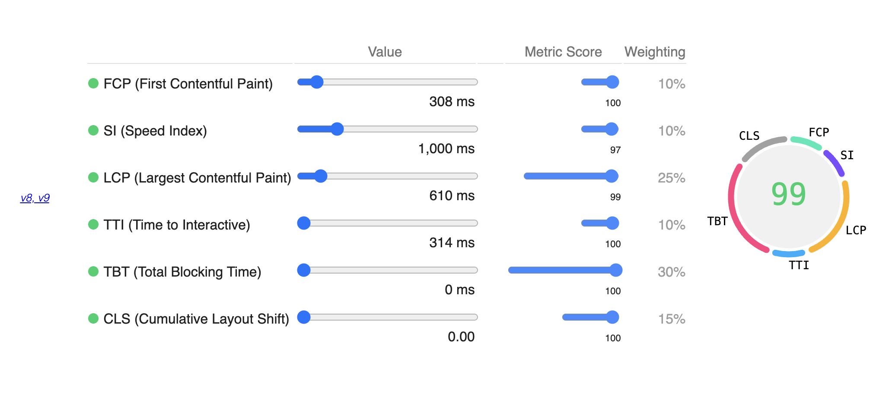
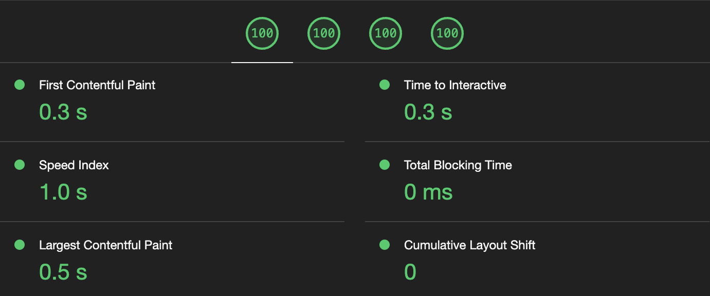

Google's Lighthouse uses six main metrics to audit the performance of a web page: FCP (First Contentful Paint),
SI (Speed Index), LCP (Largest Contentful Paint), TTI (Time to Interactive), TBT (Total Blocking Time) and
CLS (Cumulative Layout Shift). I won't be explaining this terminologies in this post as I am not yet properly
acquainted with some of their mechanism. 

A simple and direct approach to achieving a perfect score is optimizing each metric separately. A point to consider while
doing so is that all these metrics do not carry equal weightage for calculating the performance score.

## Scoring Calculator

At the time of writing, the Lighthouse v10 has the following distribution for the final score:
| Metric    | Weightage |
| --------- | --------- |
| FCP       | 10%       |
| SI        | 10%       |
| LCP       | 25%       |
| TBT       | 30%       |
| CLS       | 25%       |

TTI was assigned a weightage of 10% in v8 and v9 but removed from version 10. Its weightage is adjusted
to CLS because TTI was affected by external factors too much. Quoting from the Chrome Developers'
<a href="https://developer.chrome.com/posts/lighthouse-10-0/" target="_blank">posts</a>, 'The way it's defined
makes it overly sensitive to outlier network requests and long tasks'. However, this change in version
did not affect my website performance because my TTI and CLS scores were already at 100%.

I built my web pages using the Astro framework, which ships zero JS by default. This feature contributed
to notable progress while improving the TTI and Contentful Paint scores. In my experience with web apps,
CLS and TBT scores are relatively easier to improve than other metrics. CLS can be tricky for client-side
rendered UIs, but we can address it using placeholder or skeleton components. Initially, the FCP reports
were poor and were somewhere around the range of 0.6ms. I followed the suggestions provided by Lighthouse
to eliminate the render-blocking resources and reduce the FCP time.

## Then There Were Two

SI and LCP are the only scores that are still not 100 and were preventing me earlier to get 100 overall.
At the time, my final calculated score was in the range of 97-99. Delegating all the component processing
to the server would lower the SI but increase the LCP score. With Astro, I can make specific components to
render client-side and make the trade-off with LCP for better SI. However, this causes a lower overall score
because of higher weightage on LCP.

The best setup I could find was an SI value of around 1000ms with a score between 95-97. LCP of 99 with a value
hovering around 650ms. The overall score for this configuration was 99. To get 100 overall, it required an LCP
value of sub 500ms. It wasn't possible because some dependencies needed to run on the client side.

Finally, I managed to hack through by preloading the resources used by client-side scripts on the server. It
balanced the LCP (~550ms) and SI (~950ms) values enough to give me the fireworks on the Lighthouse tab.

These observations help us to form a general understanding of how websites are supposed to behave.
My interpretation of the weight allocation for SI and LCP is as follows:
1. If the server response is longer, the page should be ready and minimal contentful action
should be done when served. Hence, the heavier weightage for good LCP time.
2. If any contentful action happens client side, the audit expects the initial server response
to be significantly faster.
